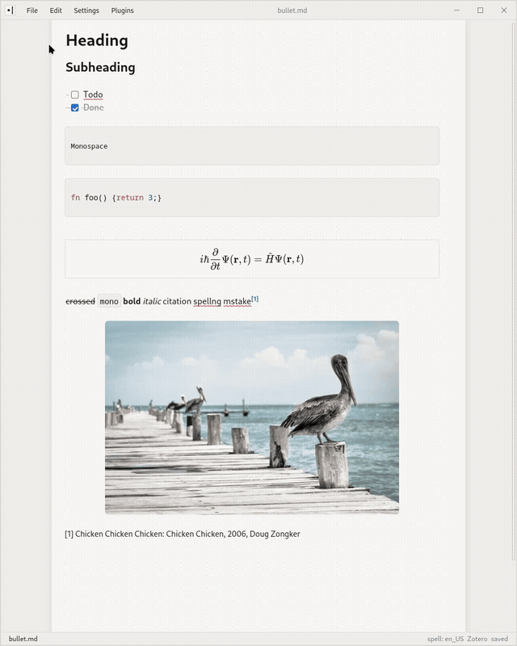

<p align="center">
  
</p>

<h1 align="center">bulletmd</h1>

<p align="center">
  A minimalist Markdown editor that renders everything except the block you're actively editing.
</p>

bulletmd is a digital bullet journal built on plain Markdown files. 
On a subtle dot-grid background, edit your notes as raw Markdown while the rest of the document renders in place.



## Why bulletmd?

Most Markdown editors force you to choose between two modes:

- raw Markdown that is precise but visually noisy;
- a rich-text editor that looks clean but hides the underlying syntax.

bulletmd keeps both aligned in a single view.
Put your cursor in a heading, link, citation, or formatted block to edit its Markdown directly.
Move away, and it returns to its rendered form.

No split pane. No preview mode. No switching contexts.

## Features

### Aligned live preview

The block under your cursor shows its raw Markdown source; every other block renders rich — the [Typora](https://typora.io/) / [Obsidian](https://obsidian.md/) "live preview" model.
Revealing a block only makes the markup characters *appear*: the text itself never restyles or reflows.

- **GitHub-Flavored Markdown** — headings, emphasis, links, lists, clickable
  task checkboxes, fenced code with syntax highlighting, blockquotes, images.
- **LaTeX math** via KaTeX — inline `$x$` and block `$$…$$`.
- **Footnotes** — `[^ref]` references and definitions.
- **Inline images**, including ones **pasted from the clipboard** — the bytes
  are saved into an assets directory and an `` reference is inserted.

### Minimal and fast

bulletmd is designed to stay out of the way: fast launch, responsive editing, a
minimal interface, and no unnecessary formatting controls.

- **Real files, safely** — debounced autosave (~1s), atomic writes that preserve
  file permissions, clean auto-reload that keeps your undo history and cursor,
  and a conflict prompt when the file changed on disk while your buffer is dirty.
- **Markdown shortcuts** — `Ctrl/Cmd+B` / `I` / `E` toggle bold / italic /
  inline code, `Ctrl/Cmd+K` wraps a link, `Tab` / `Shift+Tab` nest and un-nest
  list items.
- **Search & replace** with regex, match-case, and whole-word toggles
  (`Ctrl/Cmd+F`)..
- **One window, one file.** `bulletmd file.md` opens an editor; each file is its
  own process, matching your window manager and desktop file associations.

### Modular plugin system

bulletmd keeps its core intentionally small. Additional functionality is
provided through optional plugins, so features that don't belong in the core
editor stay out of your way until you want them.

| Plugin      | Description                                          |
| ----------- | ---------------------------------------------------- |
| Zotero      | Insert and manage Pandoc-style citations from Zotero |
| Spell check | Inline spelling and language checks                  |
| PDF export  | Export documents to PDF                              |
| Page break  | Insert page breaks for printing and export           |

The plugin system can also add custom commands, integrations, and
document-processing tools. See [`plugins/`](plugins/README.md) for each bundled
plugin and its setup guide.

## Installing

> **Status:** Linux packages are available as `.deb`, `.rpm`, and AppImage.
> macOS application and DMG bundles are configured but still need testing on
> supported Apple hardware. Windows remains untested.

Download the latest bundle for your platform from the
[Releases page](https://github.com/Garfield1002/bulletmd/releases).

### Linux

Install the `.deb` or `.rpm` to register bulletmd's application entry, icon, and
`text/markdown` file association with your desktop. The AppImage is portable but
does not install a permanent application-menu entry by itself.

### macOS

Move `bulletmd.app` into Applications, or install it from the DMG. Finder opens
associated `.md` / `.markdown` documents through the native application, opening
a separate window (process) for each document.

Prefer building from source? See [DEVELOPERS.md](DEVELOPERS.md).

## Using bulletmd

| Action | How |
| --- | --- |
| Open a file | `bulletmd file.md`, or File → Open |
| New untitled buffer | `bulletmd` with no argument, or File → New |
| New window | File → New Window (spawns a separate process) |
| Save | `Ctrl/Cmd+S` (untitled buffers prompt for a location) |
| Bold / italic / inline code | `Ctrl/Cmd+B` / `I` / `E` |
| Insert link | `Ctrl/Cmd+K` |
| Follow a link | `Ctrl/Cmd+Click` |
| Nest / un-nest a list item | `Tab` / `Shift+Tab` |
| Find & replace | `Ctrl/Cmd+F` |
| Undo / redo | `Ctrl/Cmd+Z` / `Ctrl/Cmd+Shift+Z` (or `Ctrl+Y`) |
| Paste an image | `Ctrl/Cmd+V` with an image on the clipboard |
| Toggle a checkbox | Click it |

### Pasting images

Pasting an image from the clipboard writes it to `assets/` under your config home
and inserts an `` reference at the cursor. The image renders
immediately in live preview.

The assets directory is shared, not co-located with the note, and the reference
uses an absolute path — so a document that lives anywhere can reference it, but
the Markdown is not self-contained if you move it to another machine.

## Configuration

bulletmd keeps a small `state.json` (recent files and appearance preferences) and
the pasted-image `assets/` directory under its **config home**:

1. `$BULLETMD_HOME`, if set and non-empty;
2. otherwise `$XDG_CONFIG_HOME/bulletmd` (or `~/.config/bulletmd`).

Set `BULLETMD_HOME` to relocate everything bulletmd persists:

```bash
export BULLETMD_HOME="$HOME/notes/.bulletmd"
```

> **Note:** pasted images render through Tauri's asset protocol, whose scope is
> `$HOME/**`. If you point `BULLETMD_HOME` outside your home directory, pasted
> images will save but won't display until that scope is widened.


## Philosophy

bulletmd is built around three principles:

1. Markdown should remain visible and editable.
2. Rendered documents should remain readable while editing.
3. Advanced features should be optional.

## Status

bulletmd is under active development. Feedback, bug reports, plugin ideas, and
contributions are welcome.

## Development

Architecture notes, the live-preview engine design, the Rust backend, build
instructions, and plugin APIs live in:

- [DEVELOPERS.md](DEVELOPERS.md) — building from source, architecture, and dev workflow
- [docs/PLAN.md](docs/PLAN.md) — the full design decision record
- [docs/PLUGINS.md](docs/PLUGINS.md) — the plugin API

## License

[MIT](LICENSE.md)
