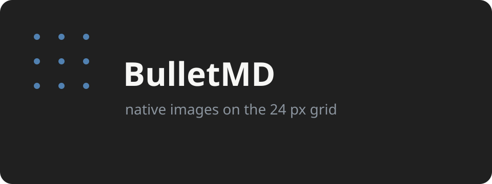

# Native Markdown
This fixture exercises the supported native editor surface — including blockquotes, thematic breaks, strikethrough, and nested lists — without tables, HTML, math, or plugins.

Inline `monospace` text uses the code background. I cant **spelll** 

## Rich blocks

Inline styles combine: *emphasis*, **strong**, `code`, and ~~struck-out~~ text can share a sentence, and ~~**bold that is also crossed out**~~ still resolves.

A thematic break separates ideas with a single rule:

---

Blockquotes draw a vertical bar, and they nest:

> A single quote reads as one bar.
> > A second marker adds a second bar for the reply.
> > > Three levels deep still lines up on the grid.

Nested lists indent one step per level, for bullets and numbers alike:

- Top-level bullet
  - Second level
    - Third level
- Back to the top
  1. Ordered child
  2. Another ordered child
     - Bullet under a number

## Editing in place
The document remains rendered until the cursor enters a block. The active block reveals its **raw Markdown** while surrounding blocks remain calm.

- Click a rendered block to activate it.
- Type ordinary text and punctuation.
- Save the result with the standard shortcut.

### Stable rhythm
Every baseline belongs to a twenty-four pixel grid. Larger headings occupy additional rows while preserving the common baseline phase.



```rust
const GRID: f32 = 24.0;
const FIRST_BASELINE: f32 = 48.0;
```

## A short walk
Morning light falls across the desk. A compact editor should open quickly, remain quiet in memory, and keep attention on the document.

The first paragraph contains *gentle emphasis*, the second contains **strong emphasis**, and this sentence contains a [local link](https://example.com).

1. Open the document.
2. Select a paragraph.
3. Edit the source.
4. Return to the rendered page.

### Notes on layout
Text shaping determines the real glyph positions. Cursor placement, selection, and hit testing use those positions instead of a second approximation.

- Blocks begin on the shared grid.
- Heights round upward to full rows.
- Downstream content moves in whole rows.

```text
baseline = 48 + row * 24
height = ceil(required / 24) * 24
```

## Working section one

An editor is more than a painted string. Input methods, selection, undo, clipboard behavior, scrolling, and saving all meet in the document surface.

This prototype deliberately implements only the smallest coherent set. It is evidence for an architectural decision rather than an unfinished product release.

- Native text input
- Native shaping
- Native hit testing
- Markdown block rendering

### Paragraph one
Clear constraints make experiments useful. A narrow prototype can fail honestly and still answer the important question.

## Working section two
The benchmark uses proportional set size because resident set size counts shared mappings in every process that maps them.

Startup is measured inside the application from process entry to the first interactive frame, avoiding guesses based on process discovery.

1. Build in release mode.
2. Open this exact fixture.
3. Wait five seconds.
4. Read the complete process tree.

### Paragraph two

The native version and the webview version should receive the same source file. Unsupported features are absent so neither implementation performs irrelevant work.

```bash
cargo build --release
./benchmark.sh native
```

## Working section three

Rendered Markdown is valuable only when editing remains predictable. Entering a block must not cause arbitrary vertical movement.

The layout reserves the larger of the raw and rendered forms, rounded to the next grid row. Genuine growth moves later blocks by exactly one or more rows.

- Preserve the block origin.
- Preserve the baseline phase.
- Recompute shaped glyph positions.

### Paragraph three

Simple prose is intentionally repeated here. The fixture should be long enough to scroll without pretending to be a stress test for enormous files.

## Working section four

GPUI supplies platform windows, GPU painting, text shaping, focus management, clipboard access, and an input-handler boundary.

BulletMD still owns the document model, Markdown mapping, grid layout, editing history, and the transition between source and rendered blocks.

1. Framework primitives remain small.
2. Product behavior remains explicit.
3. Measurements remain attributable.

### Paragraph four

The light theme uses a centered writing column, restrained colors, and a subtle field of dots aligned to the baseline grid.

```rust
fn snap(value: f32) -> f32 {
    (value / 24.0).ceil() * 24.0
}
```

## Working section five

Saving writes the current buffer to the selected path. The prototype does not implement autosave, conflict handling, atomic replacement, or permission preservation.

Those production behaviors already exist in the Rust backend and are not necessary to test the native rendering hypothesis.

- One window
- One file
- One document surface

### Paragraph five

Undo and redo retain bounded snapshots. This is sufficient for the prototype even though a production editor would use compact transactions.

## Working section six

Keyboard navigation covers horizontal and vertical movement, selection, deletion, insertion, clipboard commands, and saving.

Compose and dead-key input travel through the platform input handler. They require a manual Fedora smoke test because synthetic unit tests cannot validate the desktop input method.

1. Focus the editor.
2. Type a composed character.
3. Confirm the visible glyph.
4. Undo the edit.

### Paragraph six

Links are rendered as readable labels. Opening links is outside this experiment because it does not influence the editor layout or resource baseline.

```text
[readable label](destination)
```

## Working section seven

The POC is successful when it produces trustworthy evidence. Passing an arbitrary threshold is useful, but a measured failure is still a completed experiment.

The recommendation should distinguish framework overhead from missing production features that would predictably add cost later.

- Continue if the margin is convincing.
- Stop if the baseline already misses badly.
- Run another experiment if one isolated risk dominates.

### Paragraph seven

No packaging, installer, migration layer, plugin compatibility, export pipeline, or cross-platform abstraction belongs in this branch.

## Working section eight

The native document should feel direct. Clicking text places the caret using the shaped line, and dragging creates a selection tied to source offsets.

Inactive rendered blocks map a click to their source boundary so the first click activates the block. A following click can position the caret within raw source.

1. Click a rendered paragraph.
2. Observe raw Markdown.
3. Click within the raw line.
4. Edit without losing the grid.

### Paragraph eight

This final section brings the fixture past a short note while keeping every construct inside the explicitly supported subset.

```rust
fn conclusion() -> &'static str {
    "measure before migrating"
}
```

## Closing

The prototype asks a focused question: can a native GPUI document preserve BulletMD's essential interaction while opening nearly instantly and remaining below one hundred mebibytes of proportional memory?

The answer belongs in measured results, not architectural folklore.
